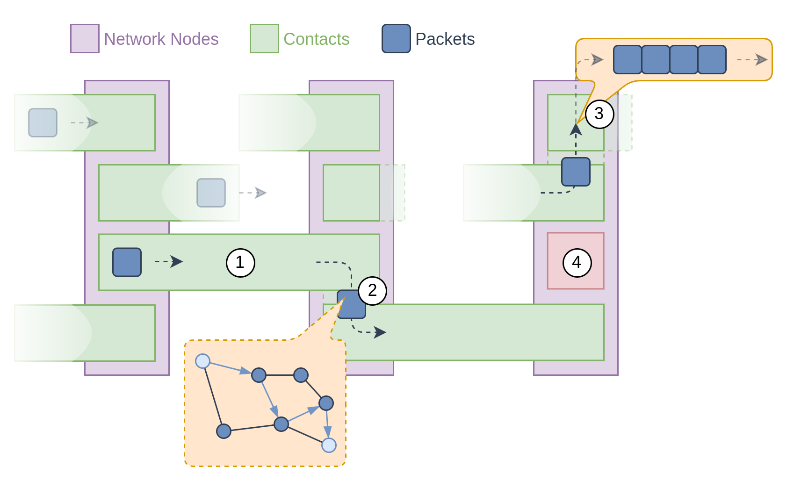
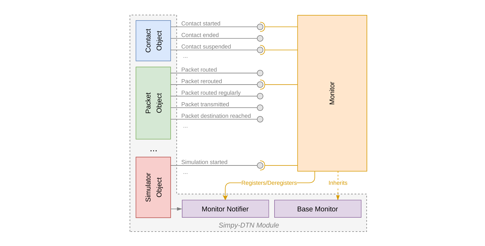

# PyDTNsim

## Introduction

This python module contains a simulation environment that allows the simulation of arbitrary Delay Tolerant Networking (DTN) scenarios on a packet (DTN terminology: bundle) level. *PyDTNsim* provides users with the ability to evaluate the performance of various routing approaches and to detect possibly occurring overload situations. Currently, the focus lies on deterministic Contact-Graph-based routing approaches, but there might be other
approaches available in the future. The clear modularization allows users to easily implement routing approaches on their own.

## Quickstart

The module makes use of features introduced in Python 3.7. Please install a 
compatible version.

```bash
# Install the Python package as editable and with development dependencies
$ pip install -e ".[dev]"

# Run the minimal example in the examples/ folder
$ python examples/minimal_example.py
```

## Structure



The above picture depicts the general functioning of the library. The network nodes are representing real nodes with a specific topology knowledge, a certain routing behaviour and storage capabilities for packets. The contacts are the driving force of the simulation. They function as generator object in the simulation context and transfer packets between node objects when being active (1). Packet objects do not entail simulation logic but are rather used as simple representations of real-world packets.

Whenever a packet reaches a network node, it is routed by that node based on arbitrary algorithms and e.g. topology information (2). If the contact that was selected by the node for forwarding the packet is already active and no other packets are scheduled for that contact, the packet will be handed over to the contact and is then immediately forwarded to the next hop.

If the contact selected for forwarding is not active yet or has already scheduled a number of packets, the new packet is appended to a FIFO queue (3). Packets will be popped from this queue as soon as the contact becomes active.

In addition to regular contacts, each node also can have a limbo queue (4). This queue is used for packets that could not be forwarded and that would otherwise have been discarded/dropped. This queue can be used to extract and retry enqueued packets at a later point in time.

Packets can be introduced into the network by injecting them manually at a node with `inject_packet(self, packet, time)` or by instantiating and registering a packet generator. Currently there are implemented a  `BatchPacketGenerator` for batch injections of packets and a `ContinuousPacketGenerator` for constant injection with a given data rate.

All described components are held together by the `Simulator` object. This object encapsulates the used simulation environment backend and is used for registering various objects such as nodes, contacts, packet generators, monitors (see next paragraph) and more. The `Simulator` object is also used to invoke the actual simulation run.

## Monitoring
The main incentive behind running network simulations is to collect certain characteristics and/or key values of the simulated topology and scenario. Being a researching/developing tool, the characteristics and key values often differ significantly.

To account for that, *PyDTNsim* provides a clear monitoring interface that is implemented using class inheritance.

The concept of this interface is depicted in the following diagram:



Many objects in the scope of *PyDTNsim* provide monitoring hooks, i.e. callback function calls that are called whenever a certain event occurs. These function calls have parameters that are suitable for the specific event.

The callback function calls are directed to a component in *PyDTNsim* called `MonitorNotifier`. Every `Simulator` object has exactly one such  `MonitorNotifier`. In addition, *PyDTNsim* has a `BaseMonitor` object that implements stub functions for all hooks provided by the components of *PyDTNsim*.

By inheriting from `BaseMonitor`, one can write monitoring instances that record and process certain events and data. The child class simply has to register itself with the `MonitorNotifier`. Afterwards, whenever a certain callback function reaches the `MonitorNotifier`, it is also relayed to the external custom monitoring instance.

Using this indirect callback approach allows to add hooks in future releases without breaking the implementation of previously developed monitoring objects. While still inheriting from the (updated) `BaseMonitor` object, for newly created hooks the stub functions will be called.

Please refer to the `BaseMonitor` source file for more details on the currently available hooks.

## Usage
*PyDTNsim* is considered to be a library module. Therefore, no direct command line execution is possible. Instead, the components of *PyDTNsim* can be easily integrated into custom scripts by the user. This is particularly helpful in the context of network simulation, as usually every user wants to simulate something different (or extract different key values).

## Topology File Structure
The topology files that can be loaded into the *ContactPlan* should follow the JSON format as described in the source file of the *ContactPlan* object. The JSON files are validated against these schemes and the loading procedure will fail if the input data does not comply with either one of the two provided ones.

## Examples
Currently, the folder *examples* contains an minimal example (`minimal_example.py`) that outlines the steps necessary to run a simulation using *PyDTNsim*. Within this file, it is documented what individual steps have to be performed.

## Limitations/Simplifications
The following limitations are known (not conclusive):
* No fragmentation is performed at node level. The packets are either fitting into the remaining bandwidth available in an contact or they are scheduled for another contact. The remaining bandwidth might be used by another smaller packet. By keeping the packet size small (and choosing suitable packet sizes and contact capacities), fragmentation side effects can be entirely avoided.
* No header overhead (let alone the header overheads of the Convergence Layers) are calculated and considered during the simulation. The simulation is routing-focused and thus disregards these factors.
* For now, no latency is considered during routing. While the input files can provide delay information and that information is also integrated into the *ContactPlan* and *ContactGraph* objects, the *SimpleCGRNode* implementation currently does not take it into account.

## Terminology
* **Packet:** In the context of this module, the term *Packet* is used synonymously with *Bundle*. That means that whenever *Packet* is used, it refers to the data unit used on the overlay network layer created by the [Bundle Protocol](https://tools.ietf.org/html/rfc5050). It refers **NOT** to packets of all underlying layers like on the transport layer of the Convergence Layers.

## Development Practices
Please refer to the [Contributing Guide](CONTRIBUTING.md) for details.

## Acknowledgements
* Thanks to Lucas Kahlert for his help to properly structure this project.
