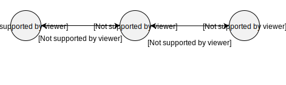

.. _getting_started:

Getting started with pyDTNsim
=============================

With *pyDTNsim* installed, we can start with running simulations using the library. In this section, a hands-on introduction into the features and the instrumentation procedure of the library module will be provided.

The goal of this introduction is to simulate the simple intermittently connected network topology as depicted below and to generate key characteristics of this simulation run.

Simulation Scenario
-------------------

The following network topology shall be simulated for 1000 seconds:

   
The annotations at the arrows represent available contact between the two (physical) network nodes that an arrow is connecting in `mathematical interval notation <https://en.wikipedia.org/wiki/Interval_(mathematics)#Including_or_excluding_endpoints>`_ in seconds. All contacts are considered to allow for a transmission of data with 100 KBps.
   
.. note:: The propagation delays are considered neglible in this scenario. This is in line with the current configuration of *pyDTNsim* which is not supporting (individual or global) delays at the moment.

The nodes ``A`` and ``C`` are representing *"active"* endpoints which are both continuously inserting packets of 100 KB with a data generation rate of 10 KBps, addressed at node ``A`` and ``C`` respectively. The data generation will continue throughout the entire simulation period.

Node ``B`` is functioning as intermediary node that is solely forwarding packets received from ``A`` and ``B``. It is neither the destination of any packets nor is it injecting any packets.

*Contact Graph Routing (CGR)* will be used as routing mechanism. See :ref:`routing_mechanisms` for more details on provided mechanisms and their implementation.

The characteristics that should be acquired with the simulation run are 

- the overall **average delivery time** of all delivered packets during the simulation run, 
- the **number of packets** enqueued into the **limbo** (i.e., packets that could not be scheduled for transmission with CGR) and
- a **histogram** of the **average delivery time** of all delivered packets throughout the simulation run.

Creating a simulation script
----------------------------
As *pyDTNsim* is a library module, we have to create a simulation script ourselves to leverage the invoke the module's functionality.

Just create a new python script file with your favorite editor or type

.. code-block:: sh

  touch dtn_simulation.py
  vim dtn_simulation.py
  
With the script created, we can now start to import the libraries components. We start with creating a :class:`pydtnsim.simulator.Simulator` object. This object represents the event-oriented simulation environment that keeps track of the simulations components and is later invoked for the actual simulation run. Details about the abstract concept of the simulation environment can be found in :doc:`architecture`.

The :class:`Simulator` can then be used to perform a simulation using it's member function :py:meth:`.Simulator.run_simulation`. For now, it is sufficient to provide this function with the simulation duration in milliseconds. It will then run a simulation from 0 ms to that provided parameter.

The following code snippet shows the most basic simulation script using the :class:`.Simulator` class. Please add this snippet to your script file.

.. code-block:: python

  from pydtnsim import Simulator
  
  def main():
      """Simulate basic scenario."""
      # Create simulation environment
      simulator = Simulator()

      # Run the simulation for 1000 seconds (1000000 ms)
      simulator.run_simulation(1000000)

  if __name__ == "__main__":
      main()
      
As no nodes or contacts were added to the :class:`.Simulator` object, nothing has to be simulated. When running the script, the output is as follows:

.. code-block:: none
  :linenos:

  > python3 dtn_simulation.py 
    Running simulation  for 1000000 ms ...
    Simulation completed!
    Simulation Results:
    - total number of packets generated: 0
    - total number of packets enqueued in limbos: 0
    - total number of packets enqueued in contacts: 0
    
Hooray, that was the first "successful" pyDTNsim simulation run! We didn't actually simulate any network but we can change that by adding simulation elements in the next step.

But first, let's have a look at the output provided by the :class:`.Simulator` object: besides the message that the simulation was completed the output also provides some simple statistics about the performed simulation run in lines *(5-7)*. In our case, no packets were generated and subsequently, no packets remained in limbos or contacts at the end of the simulation run.

Adding simulation elements
--------------------------

Injecting Data Packets
----------------------

Monitoring of the Simulation
----------------------------

Running a Simulation
--------------------

Post Processing and Evaluation
------------------------------
